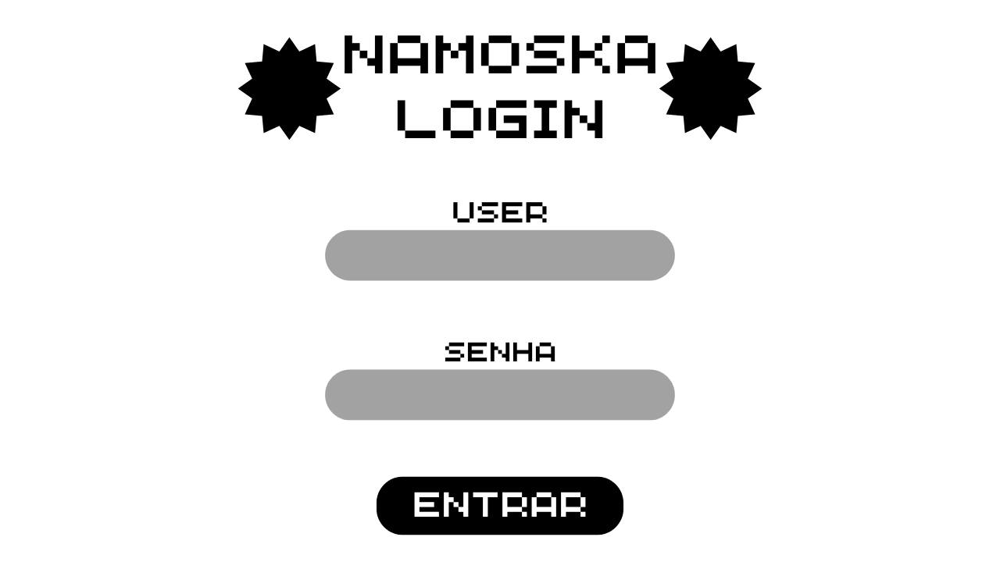
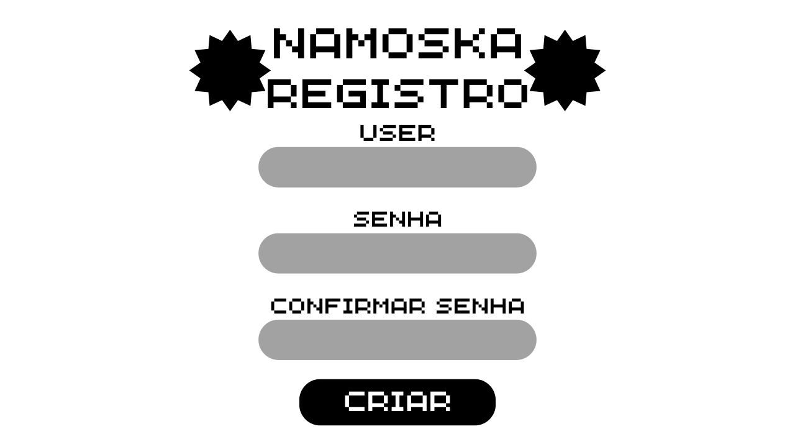
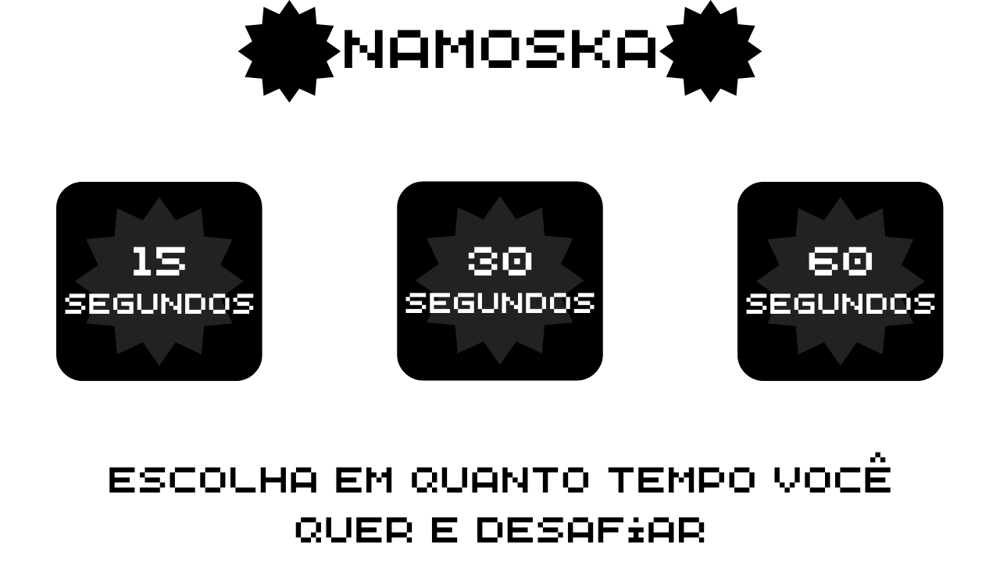
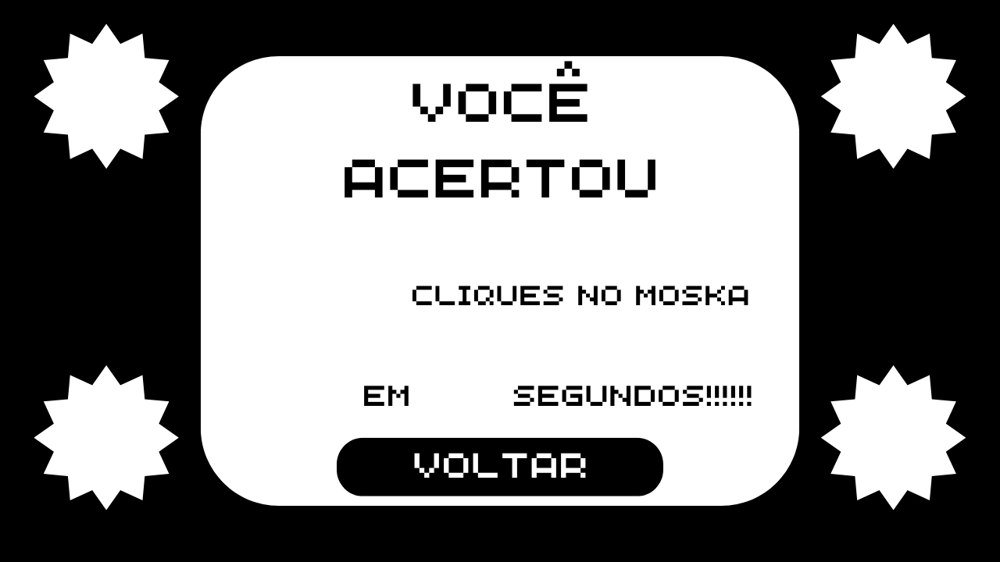

<<<<<<< HEAD
# 🎯 NaMoska - Jogo da Mosca

Um jogo interativo desenvolvido em **C#** utilizando **.NET 8.0** e **Windows Forms**, onde o objetivo é capturar elementos gráficos (Mosca - Apelido do professor da disciplina) que aparecem aleatoriamente na tela dentro de um tempo determinado.

## 🛠️ Tecnologias Utilizadas

### **C# (.NET 8.0)**
- **Framework**: .NET 8.0 para Windows
- **Interface Gráfica**: Windows Forms
- **Linguagem**: C# com recursos modernos
- **Arquitetura**: Aplicação desktop nativa para Windows

### **Recursos .NET Implementados**
- **Windows Forms**: Interface gráfica rica e responsiva
- **System.IO**: Manipulação de arquivos para sistema de login
- **System.Threading**: Controle de tempo e delays
- **System.Drawing**: Posicionamento dinâmico de elementos
- **Timers**: Controle de tempo de jogo e movimentação

## 🎮 Funcionalidades

### **Sistema de Autenticação**
- Login com usuário e senha
- Cadastro de novos usuários
- Validação de credenciais via arquivo texto
- Persistência de dados local

### **Mecânica do Jogo**
- Mosca que se move aleatoriamente pela tela
- Sistema de pontuação em tempo real
- Timer configurável para duração da partida
- Interface intuitiva com feedback visual

### **Telas do Sistema**
- **Form1**: Tela de login principal
- **Cadastro**: Registro de novos usuários
- **Tempo**: Seleção de duração da partida
- **Jogo**: Tela principal do jogo
- **Final**: Exibição de resultados

## 🏗️ Estrutura do Projeto

```
NaMoska/
├── NaMoska.csproj          # Configuração do projeto .NET
├── Program.cs              # Ponto de entrada da aplicação
├── Form1.cs               # Tela de login
├── Cadastro.cs            # Tela de cadastro
├── jogo.cs                # Lógica principal do jogo
├── timer.cs               # Seleção de tempo
├── final.cs               # Tela de resultados
└── Properties/            # Recursos e configurações
```

## ⚙️ Configuração do Projeto (.csproj)

```xml
<Project Sdk="Microsoft.NET.Sdk">
  <PropertyGroup>
    <OutputType>WinExe</OutputType>
    <TargetFramework>net8.0-windows</TargetFramework>
    <UseWindowsForms>true</UseWindowsForms>
    <ImplicitUsings>enable</ImplicitUsings>
    <Nullable>enable</Nullable>
  </PropertyGroup>
</Project>
```

## 🚀 Como Executar

### **Pré-requisitos**
- .NET 8.0 SDK ou superior
- Windows 10/11
- Visual Studio 2022 ou VS Code

### **Execução**
```bash
# Clone o repositório
git clone https://github.com/diogoomafra/NaMoska.git

# Navegue até o diretório
cd NaMoska/NaMoska/NaMoska

# Execute o projeto
dotnet run
```

## 🎯 Características Técnicas C#

### **Programação Orientada a Objetos**
- Classes para cada formulário
- Herança de `Form` do Windows Forms

### **Manipulação de Eventos**
- Event handlers para cliques de botão
- Timers para controle de tempo
- Eventos de formulário (Load, Click, etc.)

### **Recursos Modernos do C#**
- Implicit usings para imports automáticos
- Sintaxe moderna do C# 12

### **Gerenciamento de Estado**
- Controle de pontuação
- Persistência de login
- Navegação entre formulários

## 📸 Imagens para plano de fundo







## 🤝 Contribuição

Contribuições são bem-vindas! Sinta-se à vontade para:
- Reportar bugs
- Sugerir melhorias
- Enviar pull requests

## 📄 Licença

Este projeto está sob a licença MIT. Veja o arquivo LICENSE para mais detalhes.

---

**Desenvolvido com ❤️ em C# e .NET 8.0**